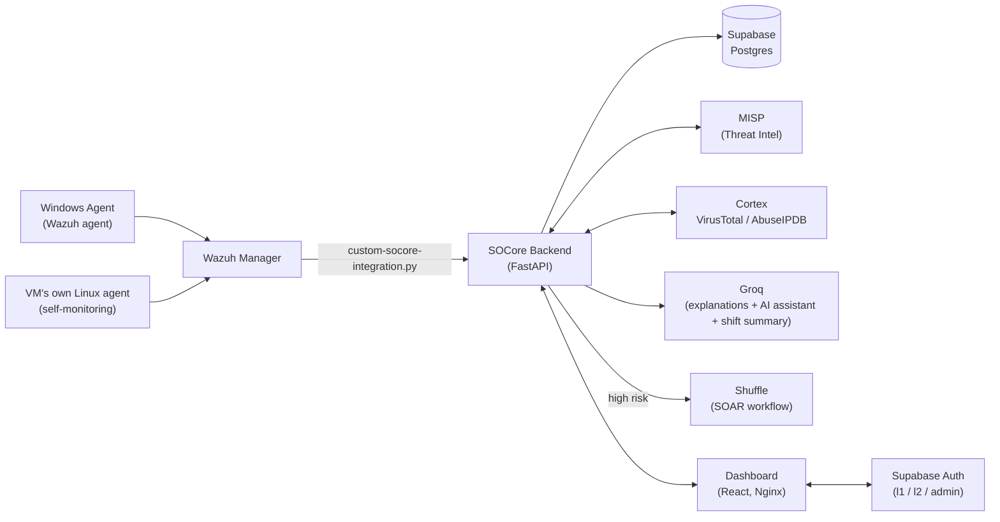

<p align="center">
  
</p>

<h1 align="center">SOCore</h1>

<p align="center">
  <b>An end-to-end SOC (Security Operations Center) platform that turns real Wazuh alerts into AI-backed, human-in-the-loop decisions.</b>
</p>

<p align="center">
  <a href="https://socore.tech"></a>
</p>

<p align="center">
  
  
  
  
  
  
  
  
</p>

---

## Table of contents

- [What it does](#what-it-does)
- [Architecture](#architecture)
- [Features](#features)
- [Tech stack](#tech-stack)
- [Project structure](#project-structure)
- [Setup](#setup)
  - [1. Supabase (database + auth)](#1-supabase-database--auth)
  - [2. Backend](#2-backend)
  - [3. Frontend](#3-frontend)
  - [4. External services (MISP / Cortex / Shuffle / Wazuh)](#4-external-services-misp--cortex--shuffle--wazuh)
  - [5. Wiring Wazuh to the backend](#5-wiring-wazuh-to-the-backend)
- [Environment variables reference](#environment-variables-reference)
- [API reference](#api-reference)
- [Deployment](#deployment)
- [Author](#author)

## What it does

SOCore ingests events from a real Wazuh SIEM, scores them by risk, explains them in plain language with AI, and hands the analyst an approve/reject decision — an end-to-end SOC platform meant to demonstrate, on real infrastructure (not a mock), the gap most classic SIEMs leave open: turning a raw stream of alerts into something an analyst can actually act on.

The pipeline is **Detect → Enrich → Respond → Track**:

1. **Detect** — Wazuh (a real Windows agent *and* a Linux agent monitoring the SOCore VM itself — SSH logins, system events) raises an event; the manager forwards it to the backend, which stores it as a raw `Event` first, independent of whatever it becomes.
2. **Enrich** — the source IP is checked against MISP (threat intel IOCs) and run through Cortex's VirusTotal/AbuseIPDB analyzers; a correlation engine combines all of that into a risk score and turns the event into a scored `Alert`.
3. **Respond** — Groq writes a plain-language explanation of why the alert was flagged. Alerts above the risk threshold propose a response action and wait for an analyst's approval (Human-in-the-Loop) before anything runs; every decision is written to an audit trail. High-risk alerts are also handed to Shuffle for SOAR automation.
4. **Track** — approved/rejected alerts, cases, and the full raw event history stay queryable from the dashboard for as long as the retention window holds.

This is not a demo/mock UI — there's a real Wazuh manager, a real Supabase Postgres database, and a real backend running on a GCP VM behind it. Live demo: **[socore.tech](https://socore.tech)**

## Architecture



The Wazuh manager forwards every event to the backend's `/api/ingest` via `custom-socore-integration.py`. The backend persists it raw first (`events` table), then — once scored — as an `Alert` (`alerts` table) in Postgres; the dashboard reads both from the API in real time. The backend also does live TCP reachability checks against Wazuh/MISP/Cortex/Shuffle/Slack via `GET /api/health` — the "Pipeline connections" / "System Health" panels in the dashboard reflect that real check, not a hardcoded flag.

## Features

- **Real Wazuh integration, from two sources** — a genuine Windows agent *and* a second Wazuh agent monitoring the SOCore VM itself (SSH logins, system events), both flowing through the exact same pipeline and noise filtering
- **AI-generated alert explanations** — every alert gets a plain-language explanation from Groq, grounded in the alert's own data (MITRE technique, VirusTotal/AbuseIPDB scores, correlation risk score) — never invented
- **AI Assistant chat** — a floating chat widget on the Dashboard that answers an analyst's question using Groq, grounded in a snapshot of the *current real* alerts/cases/pending-approvals (sent as context on every request, so it can't hallucinate an alert that doesn't exist)
- **AI Shift Summary + Excel export** — a Groq-written shift recap for an 8/12/24-hour window on the Reports page (5-minute cache), plus a one-click export of that same window as a full Excel workbook: an Executive Summary sheet (KPI cards, charts, the AI text) and Alerts/Cases/Events/Decisions detail sheets, built with `openpyxl` — real Excel Tables, frozen header rows, severity/status color coding, no formulas (so no `#REF!`/`#VALUE!` risk)
- **Human-in-the-Loop approval flow** — alerts above the risk threshold wait for an analyst's approve/reject before any response action runs; every decision is written to an audit trail
- **Real threat intelligence** — MISP IOC lookups and Cortex's VirusTotal/AbuseIPDB analyzers enrich every alert with real reputation data
- **SOAR automation** — high-risk alerts are automatically handed to a Shuffle workflow
- **Case management** (in-house, replaces TheHive) — a Kanban board (Open / Investigating / Contained / Closed) with notes, tasks, and linked alerts
- **MITRE ATT&CK Center** — the full Enterprise matrix with a live coverage status per technique (detected / tested-passed / tested-failed / not-tested), computed from real alerts and simulation runs — plus a technique detail view with its related alerts, cases, and simulation history
- **Simulation Center** — controlled, evidence-based detection validation: an analyst runs a documented manual test (e.g. an SSH brute-force attempt), SOCore opens a detection window, and the result (PASS/PARTIAL/FAIL/NOT OBSERVED) is decided only from whatever real Wazuh event and alert actually land — SOCore never executes the test itself
- **3-tier role-based access** — Supabase Auth with `l1_analyst` / `l2_analyst` / `admin`; some actions (e.g. jumping directly into a connected integration's own UI) are gated to L2/Admin; new signups wait for admin approval before they can use the app
- **Per-user timezone** — every analyst picks their own IANA timezone; every alert/event/case/report timestamp renders in it, not a hardcoded UTC
- **Persistent storage** — every event, alert, and case lives in Supabase Postgres, survives restarts
- **A separate Event/Alert model** — the raw form of every Wazuh event (`Event`) is tracked independently of whatever scored result it produced (`Alert`), so nothing is silently discarded even if it didn't clear the alert threshold
- **Live Pipeline Connections / System Health** — every integration's (Wazuh/MISP/Cortex/Shuffle/Slack) "connected" badge is a real TCP reachability check against the actual service, not a static flag

## Tech stack

| Layer | Technologies |
|---|---|
| **Backend** | FastAPI, Python 3, Supabase (Postgres), Groq (AI explanations, chat, shift summary), openpyxl (Excel export) |
| **Frontend** | React 19, Vite, TypeScript, Tailwind CSS |
| **SIEM / Threat Intel / SOAR** | Wazuh (manager + 2 agents), MISP, Cortex (VirusTotal, AbuseIPDB analyzers), Shuffle |
| **Auth** | Supabase Auth (3 roles: `l1_analyst` / `l2_analyst` / `admin`, with registration approval) |
| **Infrastructure** | Google Cloud Platform (GCP), Nginx, Let's Encrypt |

## Project structure

```
SOCore/
├── socore-backend/     # FastAPI backend — ingest, correlation, AI (explain/chat/summary), Excel export, API
│   ├── app/             # Application code (main.py has the full route list)
│   ├── requirements.txt
│   ├── .env.example
│   └── supabase_migration_profiles.sql   # Run this in Supabase's SQL editor before first use
├── design_zip/          # React + TypeScript dashboard (frontend)
├── wazuh-integration/   # Wazuh manager -> backend integration script
└── docs/                # Documentation (external-service setup checklist, etc.)
```

## Setup

You'll need: Python 3.11+, Node 18+, a free [Supabase](https://supabase.com) project, and a [Groq](https://console.groq.com) API key at minimum. MISP/Cortex/Shuffle/Wazuh are optional — every integration that isn't configured degrades gracefully (mock/skip mode) rather than crashing the app.

### 1. Supabase (database + auth)

1. Create a project at [supabase.com](https://supabase.com).
2. Open **SQL Editor** and run the contents of [`socore-backend/supabase_migration_profiles.sql`](socore-backend/supabase_migration_profiles.sql) — this creates the `profiles` table, the trigger that auto-creates a profile on signup, the role/status/theme/timezone columns and their constraints, and the storage policies for avatar uploads. It's idempotent, safe to re-run.
3. Under **Storage**, create a public bucket named `avatars` (the SQL above sets its access policies, but the bucket itself has to be created from the dashboard).
4. Grab your connection details from **Settings → API** (`Project URL`, `anon`/`publishable` key) and **Settings → Database** (`Direct connection string`) — you'll need them below.
5. After you sign up once through the app, promote yourself to admin directly in SQL:
   ```sql
   update public.profiles set role = 'admin', status = 'approved' where email = 'you@example.com';
   ```

### 2. Backend

```bash
cd socore-backend
python3 -m venv .venv && source .venv/bin/activate
pip install -r requirements.txt

cp .env.example .env
# Fill in DATABASE_URL and SUPABASE_URL at minimum (see the reference table
# below) — the app won't authenticate anyone without SUPABASE_URL, and won't
# persist anything without DATABASE_URL. Everything else is optional.

uvicorn app.main:app --reload --port 8000
```

Interactive API docs: `http://localhost:8000/docs` — every endpoint is testable from there without writing a client.

### 3. Frontend

```bash
cd design_zip
npm install

# Create design_zip/.env:
#   VITE_API_URL=http://localhost:8000
#   VITE_SUPABASE_URL=<your Supabase project URL>
#   VITE_SUPABASE_ANON_KEY=<your Supabase publishable/anon key>

npm run dev
```

If the backend isn't reachable, the dashboard falls back to seeded sample data automatically — you can explore the whole UI without it running, though nothing will persist and AI/integration features won't have anything real to work with.

### 4. External services (MISP / Cortex / Shuffle / Wazuh)

These are optional but needed for the full pipeline (threat intel enrichment, SOAR automation, and a real event source) to actually do something. Step-by-step instructions for standing each of them up and getting their API keys: **[docs/SETUP-CHECKLIST.md](docs/SETUP-CHECKLIST.md)**.

### 5. Wiring Wazuh to the backend

See [`wazuh-integration/README.md`](wazuh-integration/README.md) for the manager-side integration script, the `ossec.conf` block that wires it up, and the noise-filtering logic that keeps things like a fresh agent's SCA compliance scan from flooding the dashboard.

If you don't have a live Wazuh manager yet, you can still exercise the whole pipeline by POSTing directly to `/api/ingest` in the shape documented in [`socore-backend/README.md`](socore-backend/README.md#wiring-up-wazuh).

## Environment variables reference

**Backend** (`socore-backend/.env`, see `.env.example` for the annotated version):

| Variable | Required | What it's for |
|---|---|---|
| `DATABASE_URL` | **Yes** | Supabase's direct Postgres connection string. Without it, nothing persists. |
| `SUPABASE_URL` | **Yes** | Your Supabase project's base URL, used to verify auth JWTs. Without it, every authenticated endpoint returns 500. |
| `GROQ_API_KEY` | Recommended | Powers alert explanations, the AI assistant chat, and shift summaries. Without it, those fall back to a deterministic template instead of a real AI call. |
| `PUBLIC_HOST` | No | Your own VM's public IP/host, used to build the "Open tool" links in `/api/health`'s connection checks (Wazuh dashboard, MISP, Cortex, Shuffle). Defaults to the demo VM's IP. |
| `SLACK_WEBHOOK_URL` | No | Incoming webhook URL for alert/decision notifications. Skipped silently if unset. |
| `MISP_URL`, `MISP_API_KEY`, `MISP_VERIFY_SSL` | No | MISP threat-intel lookups. Skipped if unset. |
| `CORTEX_URL`, `CORTEX_API_KEY` | No | Cortex VirusTotal/AbuseIPDB analyzers. Skipped if unset. |
| `SHUFFLE_WEBHOOK_URL` | No | The specific workflow's webhook-trigger URL (not the base Shuffle URL) for high-risk alerts. Skipped if unset. |

**Frontend** (`design_zip/.env`):

| Variable | Required | What it's for |
|---|---|---|
| `VITE_API_URL` | **Yes** | Base URL of the backend (e.g. `http://localhost:8000` or `https://api.yourdomain.com`). |
| `VITE_SUPABASE_URL` | **Yes** | Same Supabase project URL as the backend's `SUPABASE_URL`. |
| `VITE_SUPABASE_ANON_KEY` | **Yes** | Supabase's public anon/publishable key (safe to ship client-side). |

## API reference

The full, current endpoint list lives in [`socore-backend/README.md`](socore-backend/README.md#endpoints) (kept in sync with `app/main.py`) — health/connections, profile, ingest, alerts, pending approvals, decisions, raw events, case management, the AI assistant chat, shift summary + Excel export, and admin (user approval/roles). Every endpoint is also explorable interactively at `/docs` once the backend is running.

## Deployment

The live demo runs on a single GCP VM: Wazuh (manager + dashboard, Docker), MISP, Cortex, and Shuffle each in their own containers, the FastAPI backend as a systemd service bound to a Docker-bridge-only address (reachable from Nginx and the Wazuh container, not from outside the VM), and the built React app served as static files by Nginx with a Let's Encrypt certificate. There's no one-command deploy script yet — see the individual READMEs above for how each piece is wired together if you're standing up your own instance.

## Author

SOCore was designed and built solo by [Tunar Eyyublu](https://github.com/wondersofcode) — the SIEM/infrastructure setup (Wazuh manager and agents, the GCP VM, deployment), the backend and correlation/AI logic, the threat intel and SOAR integrations (MISP, Cortex, Shuffle), and the detection rules, dashboard, and documentation.
