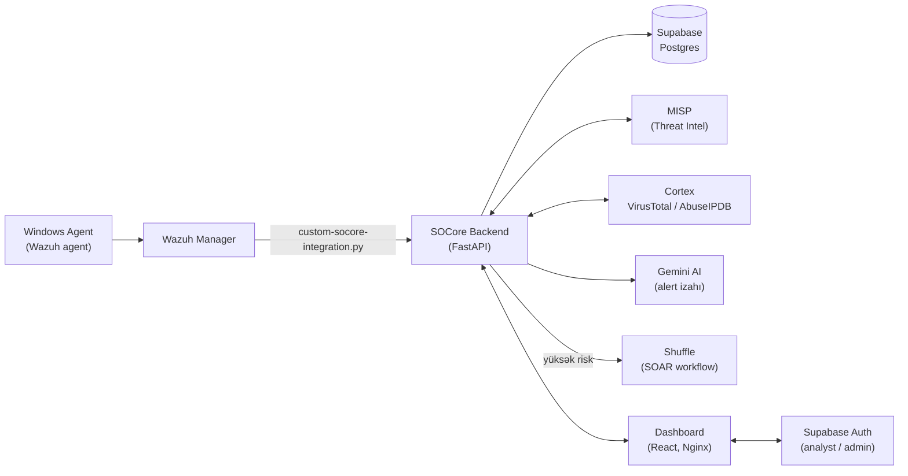

<p align="center">
  
</p>

<h1 align="center">SOCore</h1>

<p align="center">
  <b>Real Wazuh alertlərini anında AI-dəstəkli qərarlara çevirən, human-in-the-loop bir SOC platforması.</b>
</p>

<p align="center">
  <a href="https://socore.tech"></a>
</p>

<p align="center">
  
  
  
  
  
  
  
  
</p>

---

## Nə edir

SOCore, real bir Wazuh SIEM-dən gələn hadisələri qəbul edən, onları risk səviyyəsinə görə skorlayan, süni intellektlə izah edən və analitikə "təsdiqlə/rədd et" qərarı verən uçdan-uca bir SOC (Security Operations Center) platformasıdır. Məqsəd, klassik SIEM-lərin doldurduğu boşluğu — xam alert selini mənalı, hərəkətə keçirilə bilən siqnala çevirmək — kiçik miqyasda, amma real infrastruktur üzərində göstərməkdir.

Zəncir belə işləyir: **Detect → Enrich → Respond → Track**. Real bir Windows agent-dən Wazuh manager-ə düşən hər hadisə əvvəlcə xam şəkildə (`Event`) saxlanılır, sonra MISP (threat intel) və Cortex/VirusTotal/AbuseIPDB (reputasiya analizi) ilə zənginləşdirilir, Gemini AI ilə insan dilində izah alır və risk skoru ilə bir `Alert`-ə çevrilir. Yüksək riskli alertlər analitikin təsdiqini gözləyən bir cavab tədbiri (Human-in-the-Loop) təklif edir; təsdiqlənən/rədd edilən hər qərar audit trail-də izlənir, lazım gəldikdə isə Shuffle üzərindən SOAR avtomatlaşdırmasına ötürülür.

Bu bir demo/mock UI deyil — arxada real Wazuh manager, real Supabase Postgres verilənlər bazası və real GCP VM üzərində işləyən bir backend var. Canlı demoya buradan bax: **[socore.tech](https://socore.tech)**

## Arxitektura



Wazuh manager hər hadisəni `custom-socore-integration.py` skripti ilə backend-in `/api/ingest` endpoint-inə göndərir. Backend hadisəni əvvəlcə xam (`events` cədvəli), sonra skorlanmış (`alerts` cədvəli) formada Postgres-də saxlayır; dashboard isə bu API-lardan real vaxtda oxuyur.

## Texnologiya stack-i

| Qat | Texnologiyalar |
|---|---|
| **Backend** | FastAPI, Python 3, Supabase (Postgres), Google Gemini AI |
| **Frontend** | React 19, Vite, TypeScript, Tailwind CSS |
| **SIEM / Threat Intel / SOAR** | Wazuh, MISP, Cortex (VirusTotal, AbuseIPDB), Shuffle |
| **Auth** | Supabase Auth (rol-əsaslı: `analyst` / `admin`) |
| **İnfrastruktur** | Google Cloud Platform (GCP), Nginx, Let's Encrypt |

## Əsas xüsusiyyətlər

- **Real Wazuh agent inteqrasiyası** — mock data deyil, real Windows agent-dən uçdan-uca doğrulanmış axın
- **AI-generated alert izahları** — hər alert Gemini ilə insan dilində, risk skorunu əsaslandıran izahla gəlir
- **Human-in-the-Loop təsdiq axını** — yüksək riskli alertlər analitikin təsdiqini gözləyir, hər qərar audit trail-ə yazılır
- **Real threat intelligence + analiz** — MISP (IOC axtarışı) və Cortex üzərindən VirusTotal/AbuseIPDB analizi
- **SOAR avtomatlaşdırması** — yüksək riskli alertlər Shuffle workflow-una avtomatik ötürülür
- **Rol-əsaslı giriş** — Supabase Auth ilə `analyst` və `admin` rolları arasında icazə ayrımı
- **Persistent verilənlər bazası** — bütün events/alerts/cases Supabase Postgres-də saxlanılır, restart-da itmir
- **Ayrı Event/Alert modeli** — hər Wazuh hadisəsinin xam forması (`Event`) skorlanmış nəticədən (`Alert`) ayrıca izlənir

## Layihə strukturu

```
SOCore/
├── socore-backend/     # FastAPI backend — ingest, korrelyasiya, AI izah, API
├── design_zip/         # React + TypeScript dashboard (frontend)
├── wazuh-integration/  # Wazuh manager → backend inteqrasiya script-i
└── docs/               # Sənədləşdirmə (quraşdırma checklist-i və s.)
```

## Quraşdırma

### Backend

```bash
cd socore-backend
python3 -m venv .venv && source .venv/bin/activate
pip install -r requirements.txt

cp .env.example .env
# .env-də DATABASE_URL (Supabase), GEMINI_API_KEY, MISP/CORTEX/SHUFFLE
# dəyərlərini doldur (boş qalsa müvafiq funksiyalar mock/skip rejimində işləyir)

uvicorn app.main:app --reload --port 8000
```

API sənədləşdirməsi: `http://localhost:8000/docs`

### Frontend

```bash
cd design_zip
npm install

# design_zip/.env faylı yarat:
#   VITE_API_URL=http://localhost:8000
#   VITE_SUPABASE_URL=<Supabase layihə URL-i>
#   VITE_SUPABASE_ANON_KEY=<Supabase publishable/anon key>

npm run dev
```

Backend işləmirsə dashboard nümunə (seed) data ilə açılır — yəni backend olmadan da UI-ı sınaya bilərsən.

### Tələb olunan xarici xidmətlər

Platforma tam işləmək üçün aşağıdakı xarici xidmətlərə ehtiyac duyur:

- **Supabase** — Postgres verilənlər bazası + Auth (analyst/admin rolları)
- **Google Gemini API key** — AI alert izahları üçün ([aistudio.google.com](https://aistudio.google.com))
- **Wazuh manager** — real SIEM hadisə mənbəyi
- **MISP** — threat intelligence (IOC axtarışı)
- **Cortex** — VirusTotal/AbuseIPDB analizatorları
- **Shuffle** — SOAR workflow avtomatlaşdırması

Hər birinin necə quraşdırılıb API key alınacağı addım-addım: **[docs/SETUP-CHECKLIST.md](docs/SETUP-CHECKLIST.md)**

## Komanda

Layihə 4 nəfərlik komanda tərəfindən aparılır:

| Rol | Məsuliyyət |
|---|---|
| **SIEM / Infrastructure** | Wazuh manager, agent-lər, GCP VM, deployment |
| **Backend / AI** | FastAPI backend, korrelyasiya məntiqi, Gemini AI inteqrasiyası |
| **Threat Intel / SOAR** | MISP, Cortex, Shuffle inteqrasiyaları və workflow-ları |
| **Detection / Docs** | Wazuh detection qaydaları, sənədləşdirmə, test ssenariləri |
